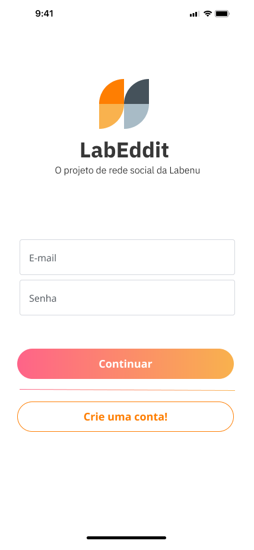
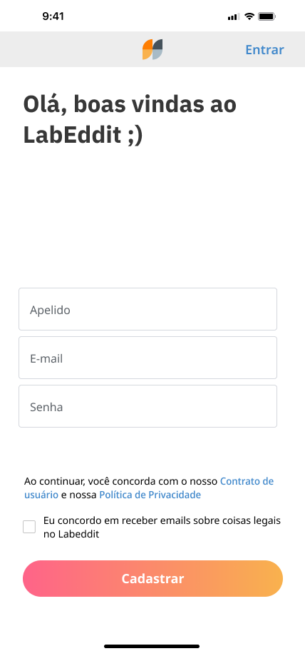
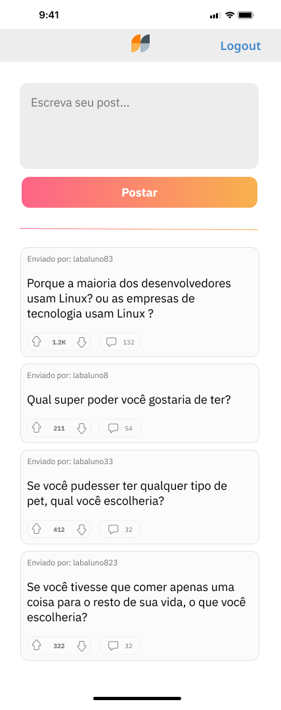
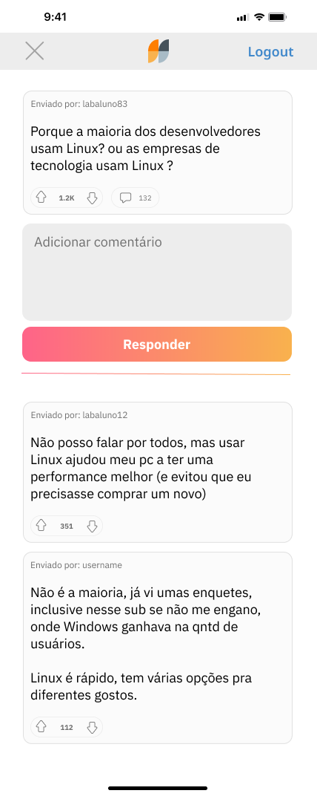

<h1 align="center">
     LabEddit - Front End
</h1>

<h4 align="left">
    O Reddit da Labenu! 
</h4>

##  🕵Sobre

Neste repositório você encontra uma rede social do estilo Reddit com a marca visual da Labenu, escola onde me formei como desenvolvedor Full-Stack. Este é o repositório do Front-End deste projeto e o repositório para o Back-End se encontra no seguinte link: https://github.com/Rottschaefer/labeddit-backend

##  👩🏾Quem Faz 

- Eduardo Rottschaefer Oliveira

Conecte-se comigo no LinkedIn! - https://www.linkedin.com/in/eduardo-rottschaefer

##  🔠Conteúdos

<!--ts-->
   * [Sobre](#sobre)
   * [Quem Faz](#-quem-faz)
   * [Status](#status)
   * [Objetivo do Projeto](#objetivo-do-projeto)
   * [Requisitos de Funcionalidade](#requisitos-de-funcionalidade)
   * [Link para Acessar](#link-para-acessar)
   * [Rodando o Projeto](#rodando-o-projeto)
   * [Sobre a Licença](#sobre-a-licença)
<!--te-->

##  🧭Status do Projeto

 - ⌛ Feito

##  🎯Objetivo do Projeto

Este é um projeto de Full-Stack, desenvolvido no bootcamp da Labenu, cujo o principal objetivo é aplicar tudo o que foi aprendido ao longo do curso.

## ☑️Requisitos de Funcionalidade

- [x] Respeitar o layout do Figma(https://www.figma.com/file/Byakv89sjTqI6NG2NRAAKJ/Projeto-Integrador-Labeddit?node-id=0%3A1&t=haX9j5M0lHbjWnAr-0)
- [x] Uso do ReactJS
- [x] Site deployado

<table>
  <tr>
    <td align="center">
      
Página de Login

      
    </td>
    <td align="center">
      
Página de Cadastro

      
    </td>
       </table>
       <table>
     <td align="center">
      
Página de Feed

      
    </td>
    <td align="center">
      
Página de Comentários

      
    </td>
  </tr>
</table>

---

## 🔗Link para Acessar

- **Link do Deploy:** https://lab-eddit.vercel.app/

## 🛰Rodando o Projeto

Para Rodar o projeto, siga as seguintes etapas :

- Faça um clone deste repositório em sua máquina com o comando git clone https://github.com/Rottschaefer/LabEddit.git
- Abra o arquivo do projeto pelo terminal
- Execute o comando npm install
- Execute o comando npm start
- Aproveite o Projeto :)

OBS: É possível que as funcionalidades do site demorem algo em torno de 30 segundos para começar a funcionar devido a natureza gratuita do serviço de hospedagem. Após esse tempo tudo corre normalment ;)

## 📝Sobre a Licença

Este projeto esta sobe a licença [MIT](./LICENSE).
